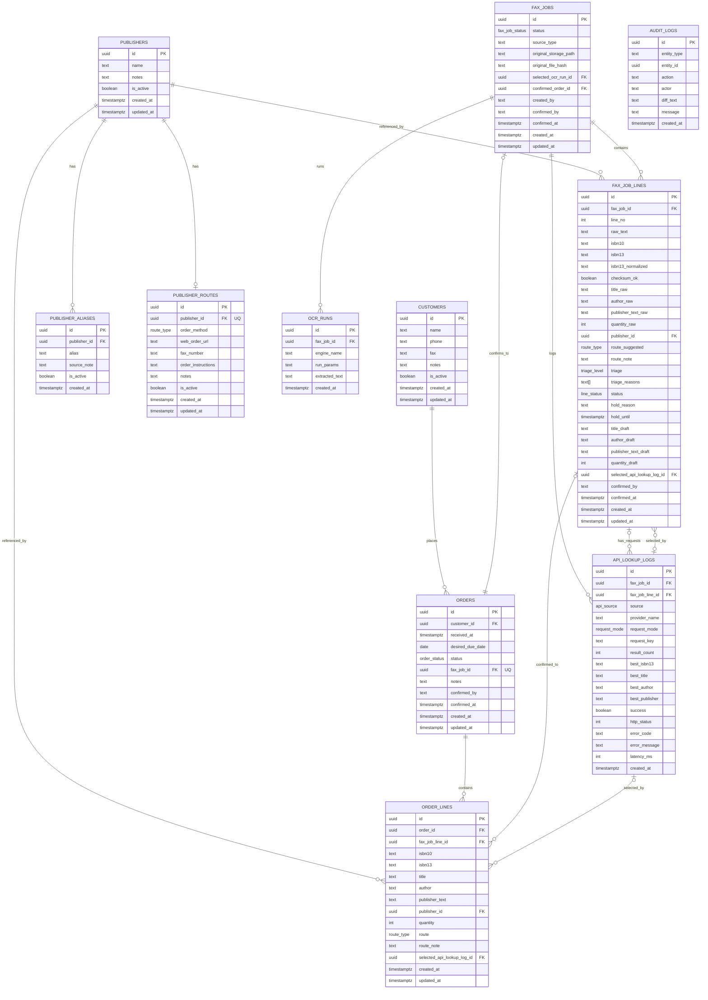

```mermaid
erDiagram
  CUSTOMERS {
    uuid id PK
    text name
    text phone
    text fax
    text notes
    boolean is_active
    timestamptz created_at
    timestamptz updated_at
  }

  PUBLISHERS {
    uuid id PK
    text name
    text notes
    boolean is_active
    timestamptz created_at
    timestamptz updated_at
  }

  PUBLISHER_ALIASES {
    uuid id PK
    uuid publisher_id FK
    text alias
    text source_note
    boolean is_active
    timestamptz created_at
  }

  PUBLISHER_ROUTES {
    uuid id PK
    uuid publisher_id FK "UQ"
    route_type order_method
    text web_order_url
    text fax_number
    text order_instructions
    text notes
    boolean is_active
    timestamptz created_at
    timestamptz updated_at
  }

  FAX_JOBS {
    uuid id PK
    fax_job_status status
    text source_type
    text original_storage_path
    text original_file_hash
    uuid selected_ocr_run_id FK
    uuid confirmed_order_id FK
    text created_by
    text confirmed_by
    timestamptz confirmed_at
    timestamptz created_at
    timestamptz updated_at
  }

  OCR_RUNS {
    uuid id PK
    uuid fax_job_id FK
    text engine_name
    text run_params
    text extracted_text
    timestamptz created_at
  }

  FAX_JOB_LINES {
    uuid id PK
    uuid fax_job_id FK
    int line_no
    text raw_text
    text isbn10
    text isbn13
    text isbn13_normalized
    boolean checksum_ok
    text title_raw
    text author_raw
    text publisher_text_raw
    int quantity_raw
    uuid publisher_id FK
    route_type route_suggested
    text route_note
    triage_level triage
    text[] triage_reasons
    line_status status
    text hold_reason
    timestamptz hold_until
    text title_draft
    text author_draft
    text publisher_text_draft
    int quantity_draft
    uuid selected_api_lookup_log_id FK
    text confirmed_by
    timestamptz confirmed_at
    timestamptz created_at
    timestamptz updated_at
  }

  API_LOOKUP_LOGS {
    uuid id PK
    uuid fax_job_id FK
    uuid fax_job_line_id FK
    api_source source
    text provider_name
    request_mode request_mode
    text request_key
    int result_count
    text best_isbn13
    text best_title
    text best_author
    text best_publisher
    boolean success
    int http_status
    text error_code
    text error_message
    int latency_ms
    timestamptz created_at
  }

  ORDERS {
    uuid id PK
    uuid customer_id FK
    timestamptz received_at
    date desired_due_date
    order_status status
    uuid fax_job_id FK "UQ"
    text notes
    text confirmed_by
    timestamptz confirmed_at
    timestamptz created_at
    timestamptz updated_at
  }

  ORDER_LINES {
    uuid id PK
    uuid order_id FK
    uuid fax_job_line_id FK
    text isbn10
    text isbn13
    text title
    text author
    text publisher_text
    uuid publisher_id FK
    int quantity
    route_type route
    text route_note
    uuid selected_api_lookup_log_id FK
    timestamptz created_at
    timestamptz updated_at
  }

  AUDIT_LOGS {
    uuid id PK
    text entity_type
    uuid entity_id
    text action
    text actor
    text diff_text
    text message
    timestamptz created_at
  }

  %% Relationships
  CUSTOMERS ||--o{ ORDERS : places

  PUBLISHERS ||--o{ PUBLISHER_ALIASES : has
  PUBLISHERS ||--o| PUBLISHER_ROUTES  : has
  PUBLISHERS ||--o{ FAX_JOB_LINES     : referenced_by
  PUBLISHERS ||--o{ ORDER_LINES       : referenced_by

  FAX_JOBS   ||--o{ OCR_RUNS          : runs
  FAX_JOBS   ||--o{ FAX_JOB_LINES     : contains
  FAX_JOBS   ||--o{ API_LOOKUP_LOGS   : logs
  FAX_JOBS   o|--|| ORDERS            : confirms_to

  FAX_JOB_LINES o|--o{ API_LOOKUP_LOGS : has_requests
  ORDERS     ||--o{ ORDER_LINES        : contains
  FAX_JOB_LINES o|--o{ ORDER_LINES     : confirmed_to

  API_LOOKUP_LOGS o|--o{ ORDER_LINES   : selected_by
  API_LOOKUP_LOGS o|--o{ FAX_JOB_LINES : selected_by

  %% AUDIT_LOGS is polymorphic (entity_type + entity_id)
```
